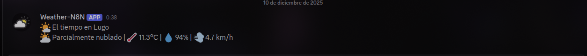

# Monitorización Casa Inteligente

## Descripción

Este proyecto simula y monitoriza una casa inteligente (IoT) mediante sensores virtuales, almacenamiento de datos en InfluxDB y visualización en Grafana. Incluye un modelo 2D interactivo de la casa y flujos de automatización con n8n.

## Arquitectura

El sistema se compone de:

- **Simulador de sensores**: Genera datos de temperatura, humedad, presencia, etc., y los envía a InfluxDB.
- **Modelo 2D de la casa**: Visualización interactiva de los sensores y su estado en tiempo real.
- **Base de datos InfluxDB**: Almacena las métricas generadas.
- **Grafana**: Permite visualizar y analizar los datos históricos y en tiempo real.
- **n8n**: Automatiza alertas y flujos de trabajo (por ejemplo, notificaciones por condiciones meteorológicas).

## Estructura del repositorio

- `simulador_casa.py`: Simulador principal de sensores IoT.
- `mapa_simulacion_casa.py` y `interactivo_mapa_casa.py`: Modelo 2D interactivo de la casa y visualización de sensores.
- `docker-compose.yml`: Orquestación de servicios (InfluxDB, Grafana, n8n).
- `WeatherN8N.json`: Flujo de ejemplo para n8n.
- Carpeta `images/`: Imágenes del modelo y simulación.

## Instalación y uso

### 1. Clona el repositorio y accede a la carpeta

```bash
git clone git@github.com:0xGeN02/iot_house.git
cd iot_house
```

### 2. Instala las dependencias de Python

```bash
python -m venv .venv
source .venv/bin/activate
pip install -r requirements.txt
```

### 3. Configura las variables de entorno

Crea un archivo `.env` con las variables necesarias (ver ejemplos en los scripts).

### 4. Lanza los servicios

```bash
docker-compose up -d
```

### 5. Ejecuta el simulador y/o el modelo 2D

```bash
python simulador_casa.py
# o para la versión con visualización interactiva
python mapa_simulacion_casa.py
```

### 6. Accede a las interfaces

- [InfluxDB](http://localhost:8086)
- [Grafana](http://localhost:3000)
- [n8n](http://localhost:5678)

## Flujo de automatización con n8n y monitorización

El flujo de trabajo de n8n (ver `WeatherN8N.json`) automatiza la obtención y el envío de datos meteorológicos externos:

1. **Obtención del tiempo**: n8n consulta una API de meteorología para obtener el estado actual del tiempo en una ciudad configurada.
2. **Procesamiento y formato**: El flujo transforma los datos recibidos y genera un mensaje descriptivo (por ejemplo, alerta de lluvia, calor extremo, etc.).
3. **Envío a InfluxDB**: Los datos meteorológicos se envían a InfluxDB, integrándose con los datos de los sensores simulados de la casa.
4. **Notificación a Discord**: Si se cumplen ciertas condiciones (lluvia, calor, etc.), n8n envía una alerta al canal de Discord configurado, permitiendo recibir notificaciones en tiempo real.
   - **¿Cómo llega la notificación a Discord?**: n8n utiliza el nodo "Discord" o realiza una petición HTTP al webhook de Discord configurado. Cuando se detecta una condición relevante (por ejemplo, lluvia), el flujo genera un mensaje y lo envía automáticamente al canal de Discord, donde los usuarios pueden recibir la alerta instantáneamente en su servidor.
5. **Visualización en Grafana**: Todos los datos almacenados en InfluxDB (tanto de sensores como meteorológicos) pueden ser visualizados y analizados en los dashboards de Grafana.

### Monitorización con Grafana

Grafana permite crear paneles personalizados para visualizar el estado de la casa inteligente:

- **Paneles de temperatura, humedad y presencia**: Puedes ver la evolución temporal de cada sensor y detectar anomalías o eventos relevantes.
- **Panel meteorológico**: Visualiza el tiempo externo junto a los datos internos de la casa.
- **Alertas y eventos**: Si se producen condiciones críticas (por ejemplo, alta temperatura o presencia inesperada), estas pueden destacarse en los paneles o generar notificaciones.

De este modo, se consigue una monitorización integral y centralizada de la casa inteligente, combinando datos internos y externos, y permitiendo la reacción automática ante eventos relevantes.

## Modelo 2D de la casa

El modelo 2D permite visualizar en tiempo real el estado de los sensores distribuidos por las habitaciones. Se puede interactuar con el plano para ver detalles de cada sensor y su evolución temporal.

### Ejemplo de visualización del modelo 2D


## Simulación y monitorización

El sistema simula eventos como cambios de temperatura, presencia o condiciones meteorológicas externas, y los muestra tanto en el modelo 2D como en los dashboards de Grafana.

### Ejemplo de simulación y monitorización


### Ejemplo de notificación meteorológica en Discord



## Dependencias principales

- Python 3.10+
- requests
- docker-compose
- InfluxDB 2.x
- Grafana
- n8n

## Créditos

Autor: 0xGeN02  
Proyecto para entrega final de la asignatura.

Repositorio en GitHub: [https://github.com/0xGeN02/iot_house](https://github.com/0xGeN02/iot_house)
